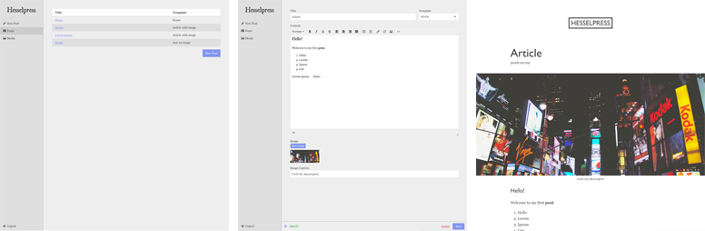

# KapowCMS
Very simple cms tool with admin and static generated html files stored in Redis.

Fast, safe, simple!



## Prerequisite
* Node
* Redis installed and running

## Install
Create a new npm project and add kapowcms as a dependency:
```shell
$ npm init
$ npm install kapowcms --save
```
Then copy database file (you can then open it and edit if you'd like):
```shell
$ cp node_modules/kapowcms/db.example.json db.json
```
Create file index.js with content:
```javascript
global.appRoot = __dirname;

const kapowcms = require('kapowcms');

kapowcms.run();
```
### Port
You can also set what port to run KapowCMS from by giving it as a parameter to the __run__ method. Default is 3000.
```javascript
kapowcms.run([], 3000);
```

## Run
```shell
$ node index.js
```

## Plugins
Add plugin by adding it as a npm dependency, for example:
```shell
$ npm install kapowcms-disqus --save
```
And then add it to the array in the __run__ method in your index.js:
```javascript
global.appRoot = __dirname;

const kapowcms = require('kapowcms');

kapowcms.run([
  require('kapowcms-disqus')
]);
```

## Create new theme
* Copy __/node_modules/kapowcms/themes/default__ to __/themes/xxx__
* Update theme in __db.json__
* Go to admin and save some post to regenerate all posts

### Examples
For every template option you can check __/node_modules/kapowcms/themes/example__

### Templates
Every template not starting with an underscore in it's filename will be available as a template for posts. Every template will by default have a title and a content field.

You can set template settings if you create a .json file with the same name as the template. The following options are available:

```json
{
  "name": "Just an image",
  "fields": [
    {
      "id": "image",
      "name": "Image",
      "type": "image"
    },
    {
      "id": "imagecaption",
      "name": "Image Caption",
      "type": "text"
    },
    {
      "id": "select",
      "name": "Select",
      "type": "select",
      "options": [
        { "id": "option1", "name": "Option 1" },
        { "id": "option2", "name": "Option 2" }
      ]
    },
    {
      "id": "selectmultiple",
      "name": "Select Multiple",
      "type": "selectmultiple",
      "options": [
        { "id": "option1", "name": "Option 1" },
        { "id": "option2", "name": "Option 2" }
      ],
      "defaultSelected": "all"
    }
  ],
  "exclude": [ "content" ]
}
```

#### name
The name of the template

#### fields
Array of custom fields for the template. Every field takes the following options:

##### id
Id of field

##### name
Name of field

##### type
Type of field. The following types are currently supported:

* text
* image
* select
* multipleselect

#### exclude
Array of fields to exclude
